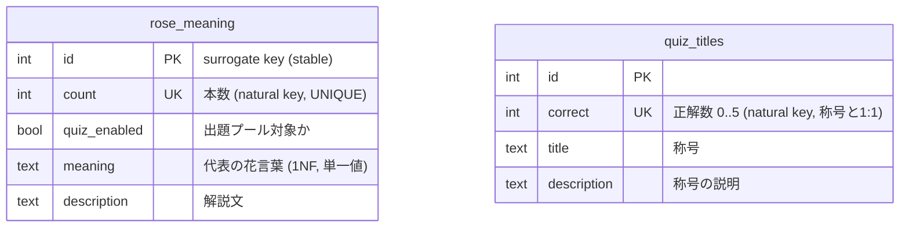

# 設計ドキュメント (v2)

バラの本数クイズ PoC の設計ドキュメント。企画背景・目的は [`spec.md`](./spec.md)、
ゲームフローは [`game_flow.md`](./game_flow.md) を参照。本書はデータ設計(本 PoC の
本命 G2)とゲーム仕様、および要決定の記録を扱う。

## 1. スコープと目標

- **G1**: 恋リア風シチュエーションでバラの本数の花言葉を学べるクイズ体験。
- **G2 (本命)**: 物理 RDB を使わないフロントエンド完結構成でありながら、
  「美しく正規化されたリレーショナルデータ設計」をデータ構造に徹底適用し、
  いつでも RDB 移行・マッピング可能な状態を検証する。

## 2. 決定事項サマリ

| 項目 | 決定 |
|---|---|
| 出題方式 | **案B**(パターンA=本数→意味の4択 / パターンB=シチュエーション→本数) |
| カード獲得 | **正解時のみ**コレクションに追加(不正解では追加しない) |
| ライフ(♡) | **廃止**。ライフ制は設けない(1ラウンド5問固定) |
| シェア | **X + LINE** |
| データマスタ | `data/` 配下の **CSV を確定ソース(source of truth)** とする |
| 花言葉(要決定1) | 1本数につき**代表の花言葉1件のみ**を保持(`meaning` 列を `rose_meaning` に統合、`meaning_variants` は廃止) |
| 出題プール(要決定2) | 酷似ペアは**有名/定番な方を残す**(片方を `quiz_enabled=false`) |
| 称号(要決定3) | **正解数と1:1(6段階、0..5各1)** のスキームを定義(§4.5) |

## 3. データ設計(正規化)

### 3.1 ER 図

### 3.2 生 CSV が抱えていた3つの負債と対策

アップロードされた生 CSV は本 PoC (G2) の格好の題材で、RDB 移行時に確実に壊れる
負債を3つ含んでいた。以下のように解消した。

1. **識別子が "行順" に暗黙依存**
   生データの本数マスタには明示的な PK 列が無く、本数を指す参照が「マスタ CSV の
   行番号」(例: 30 行目 = 100 本)に相当していた。行を並べ替えた瞬間に参照が壊れる。
   → **明示的サロゲートキー `id` を採番**。`count`(本数)は UNIQUE な自然キーとして
   分離。同一性は行順ではなく `id` に固定。

2. **1NF 違反(1セル複数値)**
   `meaning` に「一目ぼれ / あなたしかいない」のように 1 セル複数値が混在
   (38 本中 15 本)。
   → **1本数につき代表(先頭)の花言葉1件のみ**を保持し、`meaning` 列を
   `rose_meaning` に統合。各セルが単一値になり 1NF を満たす。
   (当初は `meaning_variants` 子テーブルへ分割する案だったが、実データは 1 本数
   最大 2 件で子テーブルが `rose_meaning` と実質 1:1 になり、`is_primary`・
   `sort_order` が冗長化するため、単一カラムに畳んで子テーブルは廃止した。)

3. **意味の重複により4択の正解が非一意**
   複数の本数が同一/酷似の花言葉を持つため、パターンA(4択)で選択肢に同居すると
   正解が定まらない。代表の花言葉に絞った結果、**衝突が残るのは代表同士が酷似する
   3ペア**のみ:

   | 本数ペア | 代表の花言葉 | 類似度 | 出題に残す側 |
   |---|---|---|---|
   | 105本 / 108本 | 「私と結婚してください」/「結婚してください」 | 0.89 | **108本**(105本を除外) |
   | 3本 / 101本 | 「愛しています」/「最高に愛しています」 | 0.80 | **3本**(101本を除外) |
   | 22本 / 25本 | 「あなたの幸せを祈ります」/「あなたの幸せを祈る」 | 0.80 | **25本**(22本を除外) |

   → `quiz_enabled` フラグで**出題プールを一意な部分集合**(38 → **35 本**)に絞る。
   除外側もコレクションには全 38 本表示するため、集める楽しさは維持される。

> **代表化で消えた衝突**: 生データ段階で検出した 13本/15本(ともに「永遠の友情」)と
> 99本/1000本(ともに「永遠の愛」)の衝突は、いずれも**副次的な花言葉**による重複だった。
> 代表(先頭)のみを残すと 13本=「永遠の友情」/15本=「ごめんなさい」、
> 99本=「永遠の愛」/1000本=「1万年の愛を誓います」で別値となり衝突しないため、
> 4 本とも**出題可に戻した**。
>
> **判断基準(要決定2)**: 残る3ペアは「より定番/有名な、または現実的に贈られる方」を
> 出題に残した。22/25 は甲乙つけがたいため、より丸い本数の 25本 を採用。方針を
> 変えたい場合は該当行の `quiz_enabled` を差し替えるだけでよい。

### 3.3 テーブル定義

#### `data/rose_meaning.csv`(本数マスタ / 38 行)

| 列 | 型 | 制約 | 説明 |
|---|---|---|---|
| `id` | int | PK | 安定サロゲートキー。欠番は再利用/再採番しない |
| `count` | int | UNIQUE, NOT NULL | 本数(自然キー) |
| `quiz_enabled` | bool | NOT NULL | 出題プール対象か(`true`/`false`) |
| `meaning` | text | NOT NULL | 代表の花言葉(単一値 = 1NF、`/` を含まない) |
| `description` | text | NOT NULL | コレクションカードの解説文 |

#### `data/quiz_titles.csv`(称号 / 6 行)

| 列 | 型 | 制約 | 説明 |
|---|---|---|---|
| `id` | int | PK | サロゲートキー |
| `correct` | int | UNIQUE, NOT NULL | 正解数(0..5)。称号と 1:1 の自然キー |
| `title` | text | NOT NULL | 称号名 |
| `description` | text | NOT NULL | 称号の説明 |

称号は正解数 0..5 と **1:1**(6 行)。各スコアに一意に定まるため範囲(下限/上限)の
判定は不要(§4.5)。

### 3.4 生 questions.csv の扱い

前回検討時に言及した生 `questions.csv`(`rose_meaning_id` が行番号に依存していた
負債源)は**本リポジトリにも git 履歴にも存在しない**ため、本 PoC では静的な
questions テーブルを持たず、**出題はマスタから動的生成**する(§5)。これにより
FK 冗長・行順依存の負債を根本から排除できる。将来、キュレーションした恋リア風
シチュエーション集を持ち込む場合は、`rose_meaning.id` を FK に持つ別テーブル
(例: `situations.csv`)として追加取り込みする。

## 4. ゲーム仕様

### 4.1 モード

- **クイズモード**: 1 ラウンド 5 問。ライフ制なし(§2)。
- **コレクションモード**: 獲得済みカード(解説)を閲覧。表示対象は全 38 本。

### 4.2 出題パターン(案B)

- **パターンA(本数 → 意味 / 4択)**: 「100% の愛は何本?」ではなく
  「N 本の花言葉は?」を提示し、正しい花言葉を 4 択から選ぶ。選択肢は
  `quiz_enabled=true` の 35 本から生成し、正解が一意になるよう担保する。
- **パターンB(シチュエーション → 本数)**: 花言葉/シチュエーションを提示し、
  対応する本数を回答 UI(ドット絵バラ、[-10][-1] 回答 [+1][+10])で入力する。

### 4.3 カード獲得ルール

- **正解時のみ**、その本数のカードをコレクションに追加する。
- 不正解では追加しない(解説は表示するが未獲得のまま)。

### 4.4 ライフ / シェア

- **ライフ(♡)は廃止**。5 問を最後まで解く。
- 結果画面から **X と LINE** にシェアする(称号と正答数を含む)。

### 4.5 称号スキーム(正解数と 1:1)

称号は正解数 0..5 と 1:1 で対応(6 段階)。各スコアに一意に定まるため、範囲判定は不要。

| 正解数 | 称号 | 説明 |
|---|---|---|
| 5 / 5 | ローズマスター | 全問正解！バラの花言葉を極めたローズマスター。 |
| 4 / 5 | ローズソムリエ | あと一歩で完璧。センス抜群のローズソムリエ。 |
| 3 / 5 | 花贈り名人 | 半分以上正解。頼れる花贈り名人。 |
| 2 / 5 | 見習いフローリスト | 少しずつ覚えてきた見習いフローリスト。 |
| 1 / 5 | バラのつぼみ | これから花開くバラのつぼみ。 |
| 0 / 5 | バラのタネ | ここから物語がはじまる。まずは1問正解を目指そう！ |

文言は `data/quiz_titles.csv` を編集すれば差し替え可能。

## 5. 出題生成ロジック(ランタイム)

静的 questions テーブルを持たず、マスタから毎回生成する。

- **パターンA**: `quiz_enabled=true` の本数を 1 つ選び、その `meaning`(代表の
  花言葉)を正解とする。誤答 3 つは、正解と**花言葉が一致しない**別の
  `quiz_enabled=true` の本数から `meaning` を採用する(§3.2-3 の一意性担保)。
- **パターンB**: `quiz_enabled=true` の本数を 1 つ選び、その `meaning` を
  提示、`count` を正解とする。

出題対象は常に `quiz_enabled=true`(35 本)。コレクション表示は全 38 本。

## 6. 要決定ログ

**解決済み**

- 要決定1(花言葉): **1本数につき代表1件のみ保持**し `meaning` 列を
  `rose_meaning` に統合(`meaning_variants` は廃止)。
- 要決定2(出題プール): 酷似ペアは**有名/定番な方を残す**。代表化で衝突は
  3ペア(3/101・22/25・105/108)に減り、除外は 101・22・105 の3本(§3.2-3)。
- 要決定3(称号): **正解数と1:1の6段階スキーム**を §4.5 に確定(バンド廃止)。

**残(実装 Slice 1 の後でも可)**

- 要決定4〜6: UI 詳細(演出・効果音・配色)、シェア文面テンプレ、
  コレクションの並び/フィルタ。実装スライスの中で順次確定する。

## 7. 実装スライス手順

- **Slice 0(本 PR)**: データ 2 枚(`rose_meaning.csv` / `quiz_titles.csv`)確定 +
  設計ドキュメント v2 + データ検証 skill(`validate-rose-data`)+
  追加運用 skill(`add-rose-meaning`)+ `AGENTS.md`。
- **Slice 1**: データローダ(CSV → 型付きオブジェクト)と
  出題ジェネレータ(§5)。ユニットテストで一意性を担保。
- **Slice 2**: クイズ UI(パターンA/B、回答 UI、正誤演出、5問ループ)。
- **Slice 3**: 結果画面(称号 + シェア X/LINE)とコレクションモード。
- 各スライスでデータに触れたら必ず `validate-rose-data` を実行する。
