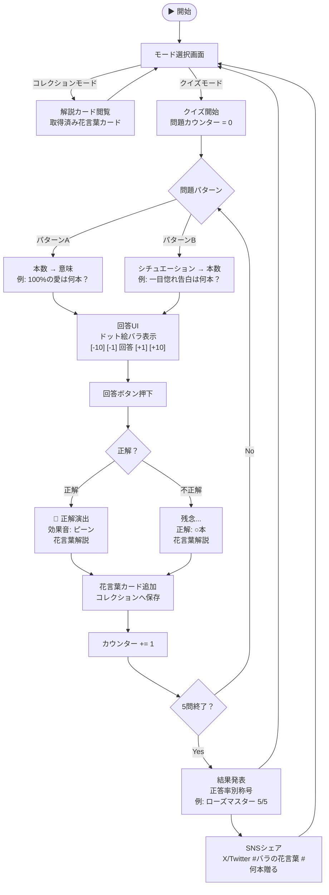

# ゲームフロー

## フロー図

```mermaid
flowchart TD
    START([▶ 開始]) --> MODE_SELECT[モード選択画面]

    MODE_SELECT -->|コレクションモード| COLLECTION["解説カード閲覧<br/>取得済み花言葉カード"]
    COLLECTION --> MODE_SELECT

    MODE_SELECT -->|クイズモード| QUIZ_INIT[クイズ開始<br/>問題カウンター = 0]

    QUIZ_INIT --> Q_TYPE{問題パターン}
    Q_TYPE -->|パターンA| Q_A["本数 → 意味<br/>例: 100%の愛は何本？"]
    Q_TYPE -->|パターンB| Q_B["シチュエーション → 本数<br/>例: 一目惚れ告白は何本？"]

    Q_A --> INPUT
    Q_B --> INPUT

    INPUT["回答UI<br/>ドット絵バラ表示<br/>[-10] [-1] 回答 [+1] [+10]"] --> SUBMIT[回答ボタン押下]

    SUBMIT --> JUDGE{正解？}

    JUDGE -->|正解| CORRECT["🌹 正解演出<br/>効果音: ピーン<br/>花言葉解説"]
    JUDGE -->|不正解| WRONG["残念...<br/>正解: ○本<br/>花言葉解説"]

    CORRECT --> ADD_COLLECTION[花言葉カード追加<br/>コレクションへ保存]
    WRONG --> ADD_COLLECTION

    ADD_COLLECTION --> COUNT[カウンター += 1]
    COUNT --> CHECK{5問終了？}

    CHECK -->|No| Q_TYPE
    CHECK -->|Yes| RESULT[結果発表<br/>正答率別称号<br/>例: ローズマスター 5/5]

    RESULT --> SNS["SNSシェア<br/>X/Twitter #バラの花言葉 #何本贈る"]
    SNS --> MODE_SELECT
    RESULT --> MODE_SELECT
```
